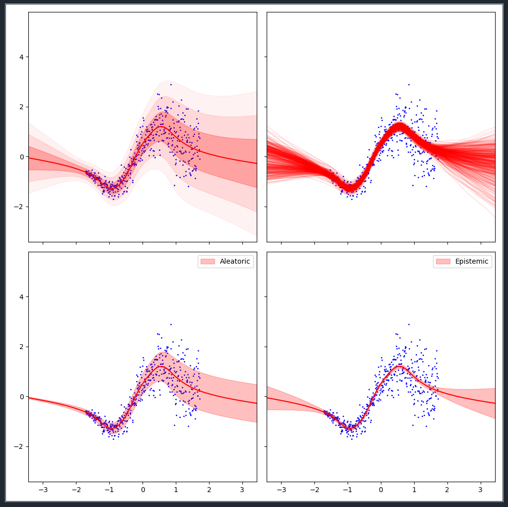

# torch-MC^2 (torch-MCMC)
HMC on 3 layer NN | HMC on GMM
:-------------------------------------------:|:------------------------------:
 | 



This package implements a series of MCMC sampling algorithms in PyTorch in a modular way:

- Metropolis Hastings
- Stochastic Gradient Langevin Dynamics
- (Stochastic) Hamiltonian Monte Carlo
- Stochastic Gradient Nose-Hoover Thermostat
- SG Riemann Hamiltonian Monte Carlo (coming ...)

The focus lies on four core ingredients to MCMC with corresponding routines:

- `MCMC.src.MCMC_ProbModel` : Probabilistic wrapper around your model providing a uniform interface
- `MCMC.src.MCMC_Chain` : Markov Chain for storing samples√
- `MCMC.src.MCMC_Optim` : MCMC_Optim parent class for handling parameters
- `MCMC.src.MCMC_Sampler`: Sampler that binds it all together


These classes and functions are constructed along the structure of the core PyTorch framework.
Especially the gradient samplers are designed around PyTorch's `optim` class to handle all things related to parameters.

# ProbModel

The wrapper `MCMC.src.MCMC_ProbModel` defines are small set of functions which are required in order to allow the `Sampler_Chain` to interact with it and evaluate the relevant quantities.

Any parameter in the model that we wish to sample from has to be designated a `torch.nn.Parameter()`.
This could be as simple as a single particle that we move around a 2-D distribution or a full neural network.

It has four methods which have to be defined by the user:

`MCMC_ProbModel.log_prob()`: 

Evaluates the log_probability of the likelihood of the model.

It returns a dictionary which the first entry being the log-probability, i.e. `{"log_prob": -20.03}`.

Moreover, additional evaluation metrics can be added to the dictionary as well, i.e. `{"log_prob": -20.03, "Accuracy": 0.58}`.
The sampler will inspect the dictionary returned by the evaluation of the model and will create corresponding running averages of the used metrics.

`MCMC_ProbModel.reset_parameters()`:

Any value that we want to sample has to be declared as a `torch.nn.Parameter()` such that the `MCMC_Optims` can track the values in the background.
`reset_parameters()` is mainly used to reinitialize the model.

`MCMC_ProbModel.pretrain()`:

In cases where we want a good initial guess to start our markov chain, we can implement a pretrain method which will optimize the parameters in some user defined manner.
If `pretrain=True` is passed during initialization of the sampler, it will assume that the `MCMC_ProbModel.pretrain()` is implemented.

In order to allow more sophisticated dynamic samplers such as `HMC_Sampler` to properly sample mini-batches, the probmodel should be initialized with a dataloader that takes care of sampling minibatches.
That way, dynamic samplers can simple access `probmodel.dataloader`.

# Chain

This is just a convenience container that stores the sampled values and can be queried for specific values to determine the progress of the sampling chain.
The samples of the parameters of the model are stored as a list `chain.samples` where each entry is PyTorch's very own `state_dict()`. 

After the sampler is finished the samples of the model can be accessed through the property `chain.samples` which returns a list of `state_dict()`'s that can be loaded into the model.

An example:

```

for sample_state_dict in chain.samples:
    
    self.load_state_dict(sample_state_dict)
    
    ... do something like ensemble prediction ...
```

`MCMC_Chain` is implemented as a mutable sequence and allows the concatination of tuples `(probmodel/torch.state_dict, log_probs: dict/odict, accept: bool)` and the concatenation of entire chains.

# MCMC_Optim

The `MCMC_Optim`'s inherit from PyTorch's very own `Optimizers` and make working with gradients just so significantely more pleasant.

By calling `MCMC_Optim.step()` they propose a new a set of parameters for `ProbModel`, the `log_prob()` of which is evaluated by `MCMC_Sampler`.

# MCMC_Sampler

The core component that ties everything together.

1. `MCMC_Optim` does a `step()` and proposes new parameters for the `ProbModel`.
2. `MCMC_Sampler` evaluates the `log_prob()` of the `ProbModel` and determines the acceptance of the proposal.
3. If accepted, the `ProbModel` is passed to the `MCMC_Chain` to be saved
4. If not accepted, we play the game again with a new proposal.

# What's the data structure underneath?

Each sampler uses the following datastructure:

```
Sampler:
    - Sampler_Chain #1
        - ProbModel #1
        - Optim #1
        - Chain #1
    - Sampler_Chain #2
        - ProbModel #2
        - Optim #2
        - Chain #2
    - Sampler_Chain #3
        .
        .
        .
    .
    .
    .

```

By packaging the optimizers and probmodels directly into the chain, these chains can be run completely independently, possibly even on multi-GPU systems.

# Final Note

The are way more sophisticated sampling packages out there such as Pyro, Stan and PyMC.
Yet all of these packages require implementing the models explicitely for these frameworks.
This package aims at providing MCMC sampling for **native** PyTorch Models such that the infamous Anon Reviewer 2 can be satisfied who requests a MCMC benchmark of an experiment.

# Final Final Note

May your chains hang low

https://www.youtube.com/watch?v=4SBN_ikibtg