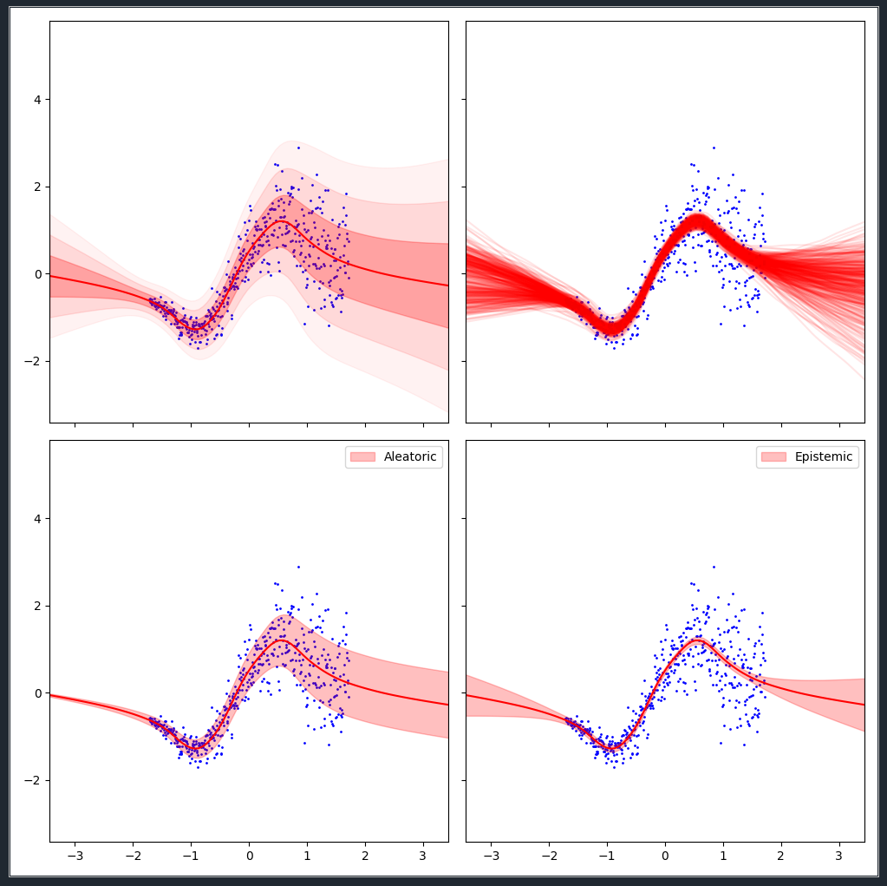

# torch-MC^2 (torch-MCMC)
HMC on 3 layer NN | HMC on GMM
:-------------------------------------------:|:------------------------------:
 | 



This package implements a series of MCMC sampling algorithms in PyTorch in a modular way:

- Metropolis Hastings
- Stochastic Gradient Langevin Dynamics
- (Stochastic) Hamiltonian Monte Carlo
- Annealed Importance Sampling

# Design Philosophy

Jax useful influence is indisputable, particularly its use of `vmap` and `pmap` to vectorize computations.
The first iteration of this package implemented the samplers via the `torch.optim` approach, which was not very flexible nor parallelizable.

Recently, `torch` has published the functional API which allows you to mimic the functional programming style of Jax.

The design philosphy centers around using TensorDicts to work with arbitrarily shaped inputs and `torch.func` to implement the samplers in a functional way.
The energy functions need to adhere to a specific signature, which allows for easy integration with the samplers: they need to take in a TensorDict with three keys, `sample`, `buffers`, and `other`, and return a scalar energy value.
`sample` is what you want to sample, `buffers` are as parallel as `sample` but aren't sampled over (think of BatchNorm, although what exactly is BatchNorm in samplers?, you can also feed in the temperature in Boltzman distribution here), and `*other` is a non-TensorDict that can contain any additional information needed for the energy computation.

```python
energy(params, buffers, other)

sample = TensorDict({
    "sample": params,
    "buffers": buffers,
    "*other": NonTensorDict({'key': value})
})
```

With the functional approach, you can easily stack multiple MCMC chains in the first dimension and wrap the energy function in a `vmap` to vectorize the computations.

```python
probmodel = ProbModel()
# probmodel.pretrain(x, y, num_steps=100, lr=1e-3) # Optional pretrain

# Create 11 parallel chains each with a full set of neural network parameters
num_chains = 11
models = [copy.deepcopy(probmodel) for _ in range(num_chains)]

# Extract the 11 parameters and buffers from the models
params, buffers = torch.func.stack_module_state(models)
init_samples = TensorDict(
    {"sample": params, # shape:[MCMC Chains, Parameters...]
    "buffers": buffers, # shape:[MCMC Chains, Buffers...]
    "data": x,
    "target": y,
    "aux": "abc"},
)

energy1 = lambda params, buffers, data, target, aux: probmodel.energy(
    probmodel.train(), params, buffers, data, target
)
# Vectorize the energy function to compute the energy for all chains in parallel
# 'sample' and 'buffers' are the first two parallelized arguments, and 'data', 'target', and 'aux' are additional arguments
vmap_energy = torch.vmap(energy1, (0, 0, None, None, None), randomness="different")
# TensorDict to torch.func compatible dict
init_args = [
    arg.to_dict() if isinstance(arg, TensorDict) else arg
    for arg in list(init_samples.values())
]
init_energy = vmap_energy(
    *init_args,
)
print(init_energy)
```

# Final Note

The are way more sophisticated sampling packages out there such as Pyro, Stan and PyMC.
Yet all of these packages require implementing the models explicitely for these frameworks.
This package aims at providing MCMC sampling for **native** PyTorch Models such that the infamous Anon Reviewer 2 can be satisfied who requests a MCMC benchmark of an experiment.

# Final Final Note

May your chains hang low

https://www.youtube.com/watch?v=4SBN_ikibtg
